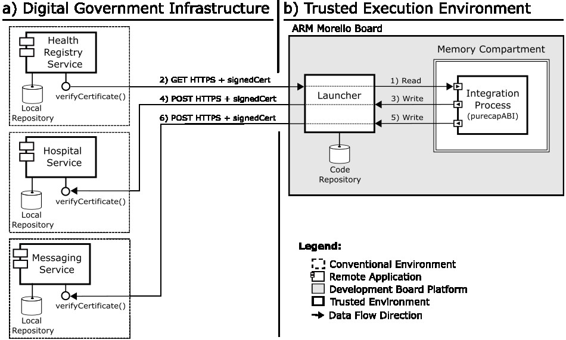

# A pilot integration project for protected healthcare data exchange on ARM Morello Board

This repository contains the implementation of the pilot integration project described in the LASDiGov 2026 experience report. The pilot addresses a real healthcare integration workflow in the city of Santa Rosa, southern Brazil, involving three digital services: **Health Registry Service**, **Hospital Service**, and **Messaging Service**. The goal is to protect sensitive patient data while they are being processed by the Integration Process, not only while they are transmitted over the network.

The solution executes the Integration Process inside a **CHERI-based Trusted Execution Environment (TEE)** on an **ARM Morello Board**. The remote digital services remain in conventional environments, but they only process requests after validating an **attestation certificate** associated with the execution environment of the Integration Process.

## Conceptual view of the pilot integration project

The healthcare workflow is based on the following scenario:

1. A patient is first attended at a **primary healthcare unit (UBS)**.
2. The **Health Registry Service** stores the patient's personal and clinical data.
3. When the patient requires hospital care, the **Hospital Service** needs access to those data.
4. The **Integration Process** retrieves the patient data from the Health Registry Service.
5. The **Integration Process** updates the Hospital Service.
6. The **Integration Process** sends a confirmation or guidance message through the **Messaging Service**.

This pilot was designed to avoid manual transcription between systems and to reduce the risk of exposing patient data during execution.

## Implementation architecture

The figure below presents the implementation architecture adopted in this repository. It must be kept in the repository because it documents the architecture discussed in the article.

<p align="center">
  
</p>

The architecture contains two execution domains:

- **Digital Government Infrastructure (conventional environment):**
  - Health Registry Service
  - Hospital Service
  - Messaging Service
  - Each service keeps its own local repository and validates incoming requests through `verifyCertificate()`.

- **Trusted Execution Environment (ARM Morello Board):**
  - Launcher
  - Integration Process
  - Memory compartment configured with CHERI capabilities

In this architecture, the **Launcher** runs outside the memory compartment but inside the Morello operating system. It is responsible for managing the program lifecycle and the attestation artefacts associated with the Integration Process.

## Main components of the repository

### 1. Launcher
The Launcher manages the pilot execution lifecycle on the Morello Board. In practical terms, it is responsible for:

- storing the source code of the Integration Process;
- compiling the program for the CHERI environment;
- executing the resulting binary with compartmentalisation enabled;
- generating the attestation certificate used by remote services.

The article describes the Launcher as the mediator between the digital services and the Integration Process. It relies on the CHERI-enabled compiler `clang-morello` and produces certificates containing verifiable attributes of the execution environment.

### 2. Integration Process
The Integration Process executes inside a CHERI-based memory compartment and acts as a client of the three digital services.

Its responsibilities are:

- read patient data from the **Health Registry Service**;
- write synchronised patient data to the **Hospital Service**;
- write a notification to the **Messaging Service**.

### 3. Health Registry Service
This service stores patient registration and healthcare data and responds to read requests issued by the Integration Process.

### 4. Hospital Service
This service receives patient data synchronised by the Integration Process, allowing hospital staff to continue care without re-entering the data manually.

### 5. Messaging Service
This service sends notifications related to the attendance workflow, such as confirmations or guidance messages to the patient.

## Directory structure

A typical project organisation is the following:

```text
.
├── App-Health-Registry/
│   ├── API_health_registry.py
│   ├── cert.pem
│   ├── priv.pem
│   └── ...
├── App-Hospital/
│   ├── API_hospital.py
│   ├── cert.pem
│   ├── priv.pem
│   └── ...
├── App-Messaging/
│   ├── API_messaging.py
│   ├── cert.pem
│   ├── priv.pem
│   └── ...
├── launcher/
│   ├── launcher.py
│   ├── command-line-interface.py
│   ├── keys/
│   ├── attestable-data/
│   │   ├── generate_certificate.py
│   │   └── signatures/
│   └── programs-data-base/
│       ├── sources/
│       ├── cheri-caps-executables/
│       └── certificates/
├── integration_process/
    └── integration_process_healthcare_cheri.c
```

Adapt the names of the service directories and scripts to your local repository if they differ.

## Dependencies

### Conventional digital services
The digital services run in conventional environments and may be implemented, for example, in Python with HTTPS enabled.

Minimum dependencies typically required on the machines that host the services:

- Python 3
- Flask (if the APIs are implemented with Flask)
- `flask_talisman` (if HTTPS headers and hardening are used)
- OpenSSL certificates for each service
- Local database engine used by each service (for example SQLite)

### ARM Morello Board / CheriBSD side
The Morello Board environment requires:

- CheriBSD with CHERI support
- `clang-morello`
- `proccontrol`
- Python 3
- OpenSSL development libraries
- pthread support
- the Launcher scripts and directories

### Integration Process build dependencies
To compile the C program:

- `clang-morello`
- `libssl`
- `libcrypto`
- `pthread`

## Attestation artefacts generated by the Launcher

During execution, the Integration Process calls the script:

```text
launcher/attestable-data/generate_certificate.py
```

This script generates, for the latest executable binary:

- `private_key.pem`
- `public_key.pem`
- `certificate.pem`
- executable signature file

The certificate includes verifiable attributes such as:

- CPU model
- number of CPUs
- memory information collected from the running process
- hash of the executable binary
- signature of the executable hash

These artefacts are saved under:

```text
launcher/programs-data-base/certificates/<program_id>/
launcher/attestable-data/signatures/
```

## Execution workflow starting from the Launcher

The steps below describe how to execute the pilot starting from the Launcher, which is the workflow expected by the article.

### Step 1 — Start the digital services
Start the three services in their conventional environments:

- Health Registry Service
- Hospital Service
- Messaging Service

Each service must expose its HTTPS API and be prepared to validate the certificate attached to incoming requests.

### Step 2 — Start the Launcher
On the Morello Board, start the Launcher:

```bash
python3 launcher/launcher.py
```

The Launcher must remain active to receive requests for upload, compilation, and execution.

### Step 3 — Upload the Integration Process source code
Use the command-line interface to upload the C source code of the Integration Process to the Launcher's source repository:

```bash
python3 launcher/command-line-interface.py upload integration_process_healthcare_cheri.c
```

The source code is stored under:

```text
launcher/programs-data-base/sources/
```

### Step 4 — Compile the Integration Process for CHERI
Compile the uploaded source code for the ARM Morello CHERI environment.

The compilation expected by the article uses the following flags:

```bash
clang-morello -march=morello+c64 -mabi=purecap -o integration_process integration_process.c
```

If compilation is triggered through the Launcher/CLI, the Launcher should place the generated binary in:

```text
launcher/programs-data-base/cheri-caps-executables/
```

### Step 5 — Run the Integration Process with compartmentalisation
Execute the binary with CHERI compartmentalisation enabled:

```bash
proccontrol -m cheric18n -s enable ./integration_process
```

If execution is triggered through the Launcher, the Launcher should issue the equivalent run command and return the program output.

### Step 6 — Generate the certificate during execution
During execution, the Integration Process invokes:

```bash
python3 launcher/attestable-data/generate_certificate.py <pid>
```

This step generates the certificate associated with the running executable.

### Step 7 — Issue attested requests to the digital services
After the certificate is available, the Integration Process performs the pilot workflow:

1. **GET** patient data from the Health Registry Service;
2. **POST** synchronised attendance data to the Hospital Service;
3. **POST** notification data to the Messaging Service.

Every outgoing request must include the attestation certificate so that the target digital service can execute `verifyCertificate()` before processing the operation.

## Suggested environment variables

To avoid exposing IP addresses and ports in the source code, configure the service endpoints with environment variables before executing the Integration Process:

```bash
export HEALTH_REGISTRY_HOST="<host>"
export HEALTH_REGISTRY_PORT="<port>"
export HEALTH_REGISTRY_ENDPOINT="/api/patients"

export HOSPITAL_HOST="<host>"
export HOSPITAL_PORT="<port>"
export HOSPITAL_ENDPOINT="/api/attendances/sync"

export MESSAGING_HOST="<host>"
export MESSAGING_PORT="<port>"
export MESSAGING_ENDPOINT="/api/notifications"
```

## What is protected in this pilot

The central concern of this pilot is **data in use**. HTTPS or VPN can protect data while they are in transit, but they do not protect sensitive data while those data are loaded into the memory of the Integration Process. In this repository, the Integration Process executes inside a CHERI-based TEE so that the data retrieved from digital services are processed within a protected execution environment.

## Expected outcome

When the pilot is correctly configured and executed:

- the Health Registry Service returns patient data;
- the Hospital Service accepts the synchronisation request only after validating the attestation certificate;
- the Messaging Service accepts the notification request only after validating the attestation certificate;
- the Integration Process runs inside a compartmentalised CHERI environment on the ARM Morello Board.

## Notes

- If the repository contains only the article figures in EPS format, export them to PNG for GitHub rendering.
- If your infrastructure uses a different header name for the attestation certificate, update the Integration Process source accordingly.
- If the Launcher later produces a CA-signed `signedCert` instead of `certificate.pem`, update the Integration Process to send that artefact in outgoing requests.

## Acknowledgements

This pilot integration project was developed in the context of research on CHERI-based trusted execution environments and digital government integration workflows involving the Arm Morello Board and the CAMB project.
